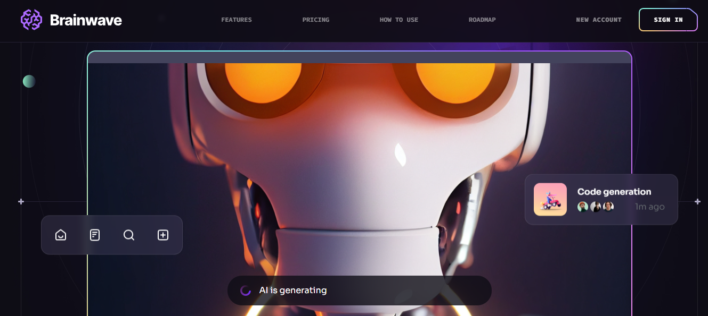

<div align="center">
  <br />
        <a href="#" target="_blank">
      
        </a>
  <br />


<h1>🤖 Brainwave AI — Modern SaaS UI/UX</h1>

  <p>
    A high-fidelity frontend implementation of a premium AI SaaS landing page.
  </p>

  <p>
    <a href="https://modern-saas-ptototype.vercel.app/" target="_blank"><strong>View Demo</strong></a> ·
    <a href="https://github.com/Tidjani1Bachir/modern_saas_ptototype/issues">Report Bug</a>
  </p>
</div>

## 🤖 Introduction

**Brainwave** is a premium UI/UX SaaS landing page developed using **React.js** and **Tailwind CSS**. 

This project is a pixel-perfect implementation of the [Brainwave AI Landing Page Kit](https://ui8.net/ui8/products/brainwave-ai-landing-page-kit) by UI8. It serves as a professional showcase of "Figma-to-Code" proficiency, featuring complex layouts, sophisticated dark-mode aesthetics, and high-performance animations that meet modern software-as-a-service standards.


## <a name="tech-stack">⚙️ Tech Stack</a>

- Vite
- React.js
- Tailwind CSS

## <a name="features">🔋 Features</a>

👉 **Stunning Sections**: Includes hero, features, pricing (monthly/yearly), FAQ, testimonials, and download software
sections.

👉 **Smooth Animations**: Complex CSS for fluid animations and eye-catching effects.

👉 **Cool CSS Gradients**: Beautiful gradient effects using CSS `before` and `after` pseudo-elements.

👉 **Seamless Navigation**: Offers a smooth user experience with intuitive navigation and scrolling.

👉 **Optimized Performance**: Built for fast loading and an optimized experience.

👉 **Pixel Perfect Design**: Ensures flawless responsiveness across all devices and screen sizes.

and many more, including code architecture and reusability

## <a name="quick-start">⏰ Quick Start</a>

Follow these steps to set up the project locally on your machine.

**Prerequisites**

Make sure you have the following installed on your machine:

- [Git](https://git-scm.com/)
- [Node.js](https://nodejs.org/en)
- [npm](https://www.npmjs.com/) (Node Package Manager)


**Installation**

Install the project dependencies using npm:

```bash
npm install
```

**Running the Project**

```bash
npm run dev
```

Open [http://localhost:5173](http://localhost:5173) in your browser to view the project.

**the UI Of The Application**

<a href="#" target="_blank">
      
</a>

<br />
<br />
<br />
<br />

<a href="#" target="_blank">
      
</a>

<br />
<br />
<br />
<br />

<a href="#" target="_blank">
      
</a>

<br />
<br />

<a href="#" target="_blank">
      
</a>

<br />
<br />

<a href="#" target="_blank">
      
</a>

<br />
<br />
<br />
<br />

<a href="#" target="_blank">
      
</a>

<br />
<br />

<a href="#" target="_blank">
      
</a>

<br />
<br />
<br />
<br />

<a href="#" target="_blank">
      
</a>


<br />
<br />

<a href="#" target="_blank">
      
</a>

<br />
<br />
<br />
<br />

<a href="#" target="_blank">
      
</a>

<br />
<br />

<a href="#" target="_blank">
      
</a>

<br />
<br />
<br />
<br />

<a href="#" target="_blank">
      
</a>


